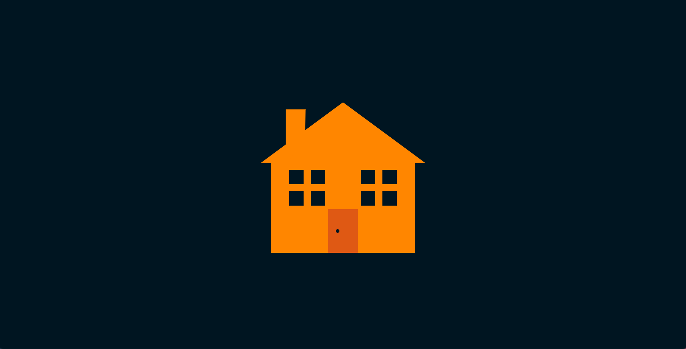

# House Coding Challenge

## 🚀 Deployment

Find the deploy [here](https://house-maksym-vasylyev.vercel.app).

## 💪 Requirements:

1. Should have Flexbox window tiles.
2. Should have Isosceles or Equilateral triangle as a roof.
3. Should have a rectangular door with circular handle.

How to submit:

Please upload the code for this project to GitHub, and post a link to your repository below.
